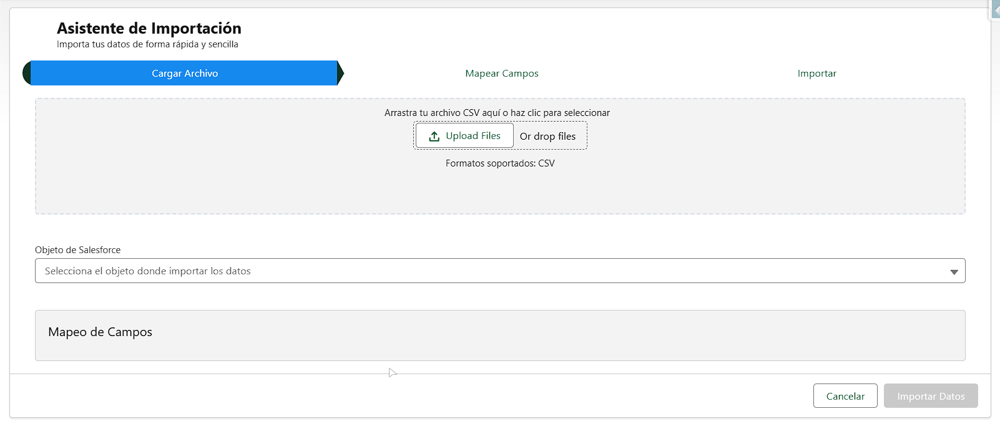
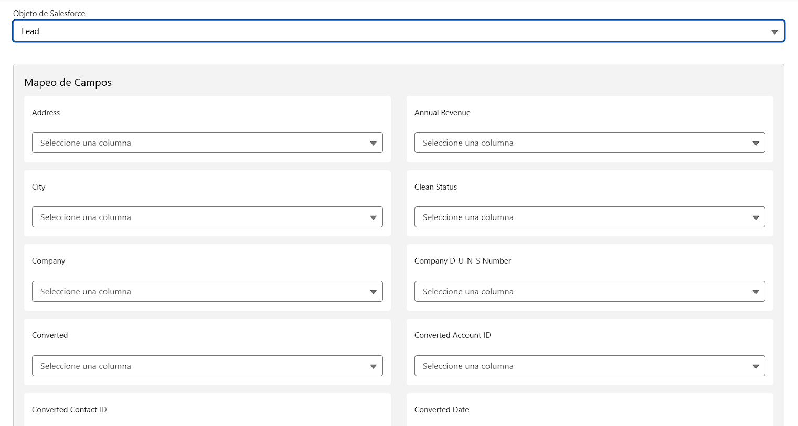
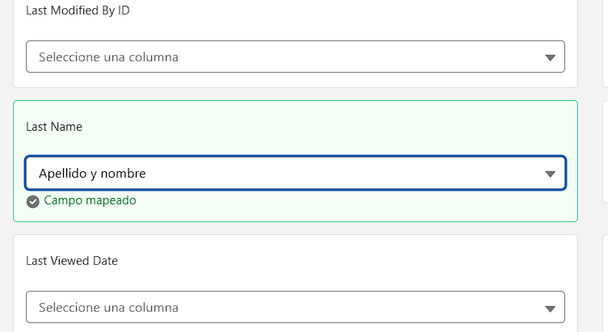
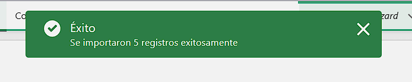

# Salesforce Data Import Wizard

Componente Lightning Web personalizado (LWC) que proporciona una interfaz intuitiva para importar datos CSV a objetos de Salesforce, con validación dinámica y mapeo de campos flexible.


## 🚀 Características



- Interfaz de usuario moderna e intuitiva usando Lightning Design System (SLDS)
- Carga y validación de archivos CSV
- Selección dinámica de objetos de Salesforce
- Mapeo visual de campos CSV a campos de Salesforce
- Validación en tiempo real de tipos de datos
- Manejo robusto de errores
- Feedback visual del proceso de importación
- Soporte para tipos de datos complejos de Salesforce

## 🛠️ Tecnologías Utilizadas


- **Lightning Web Components (LWC)**
  - Componentes web nativos
  - Reactividad basada en decoradores
  - Gestión de eventos personalizada
  - Diseño responsivo con SLDS

- **Apex**
  - Clases con sharing para seguridad
  - Métodos cacheable para optimización
  - Manejo de tipos de datos dinámicos
  - Procesamiento de archivos CSV
  - Validación de datos robusta
  - Manejo de excepciones personalizado
  - Operaciones DML optimizadas

## 📋 Funcionalidades Técnicas

### Seguridad y Validación



- Verificación de permisos CRUD a nivel de objeto
- Validación de accesibilidad de campos
- Limpieza y sanitización de datos CSV
- Manejo seguro de ContentVersion

### Procesamiento de Datos



- Parseo inteligente de CSV con soporte para campos entre comillas
- Conversión automática de tipos de datos
- Procesamiento por lotes para grandes volúmenes
- Mapeo dinámico de campos

### Interfaz de Usuario
- Indicador de progreso por pasos
- Feedback visual de mapeo de campos
- Mensajes de error contextuales
- Estado de carga y procesamiento

## 🔍 Conocimientos Demostrados




1. **Desarrollo Apex Avanzado**
   - Uso de Schema Describe para metadatos
   - Implementación de patrones de diseño
   - Manejo eficiente de colecciones
   - Optimización de consultas SOQL
   - Procesamiento de datos en lote

2. **Desarrollo LWC**
   - Arquitectura basada en componentes
   - Comunicación padre-hijo
   - Manejo de eventos
   - Integración con Apex
   - Diseño responsivo

3. **Mejores Prácticas de Salesforce**
   - Governor Limits
   - Bulkification
   - Seguridad y sharing
   - Manejo de errores
   - Patrones de diseño

## ⚙️ Instalación

1. Desplegar los componentes usando Salesforce CLI:
```bash
sfdx force:source:deploy -p force-app/main/default
```

2. Asignar los permisos necesarios a los usuarios:
   - Acceso al componente LWC
   - Permisos CRUD en objetos destino
   - Acceso a Apex Class

## 🤝 Contribuciones

Las contribuciones son bienvenidas. Por favor, crear un issue o submit un pull request.

